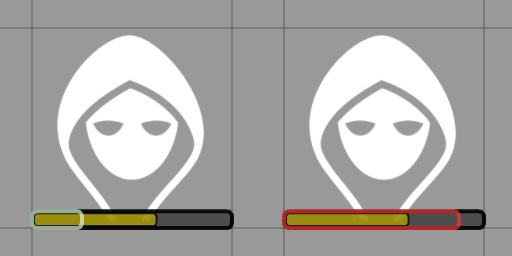

# Arbron's Improved HP Bar

Modifies the HP bar in various systems to represent the complexities of character health.

### Temp HP
Displays a blue bar overlaying the current HP. If temp HP exceeds max HP, the bar will rescale to properly represent the proportion of temp to max.

### Max HP (5e only)
Displays positive temp max HP as a light grey addition to the bar on the right side and negative max as a dark gray bar. The color of the current HP bar is changed to accurately reflect the current max HP.

### Nonlethal (D&D 3.5e & Pathfinder 1e)
Displays an outline over the HP bar that is light green if the current nonlethal damage is less than current HP (aka not staggered) and red if it exceeds current HP.

#### Supported Systems
D&D [3.5e](https://foundryvtt.com/packages/D35E) & [5e](https://foundryvtt.com/packages/dnd5e), Pathfinder [1e](https://foundryvtt.com/packages/pf1) & [2e](https://foundryvtt.com/packages/pf2e), [Toolkit13 (13th Age Compatible)](https://foundryvtt.com/packages/archmage)

